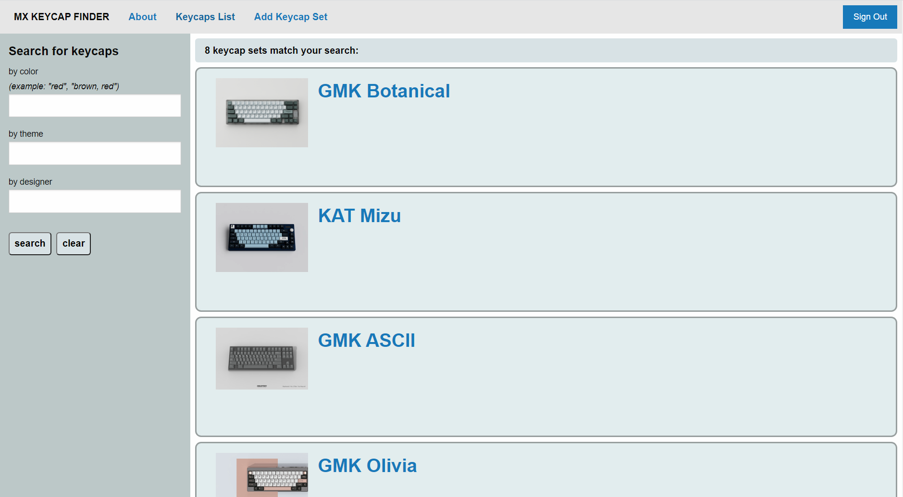

# mx-keycap-finder
website that catalogs a searchable database of mx-compatible keycaps

being built on the PERN stack (PostgreSQL, Express, React, NodeJS)

## installation
download or clone the repository to the directory of your choice and run
`$yarn run install`
to setup default configurations to get the website up and running.

## usage
run
`$yarn run dev`
from the root of the repository to start your local webserver hosting the website at localhost:3000

#
